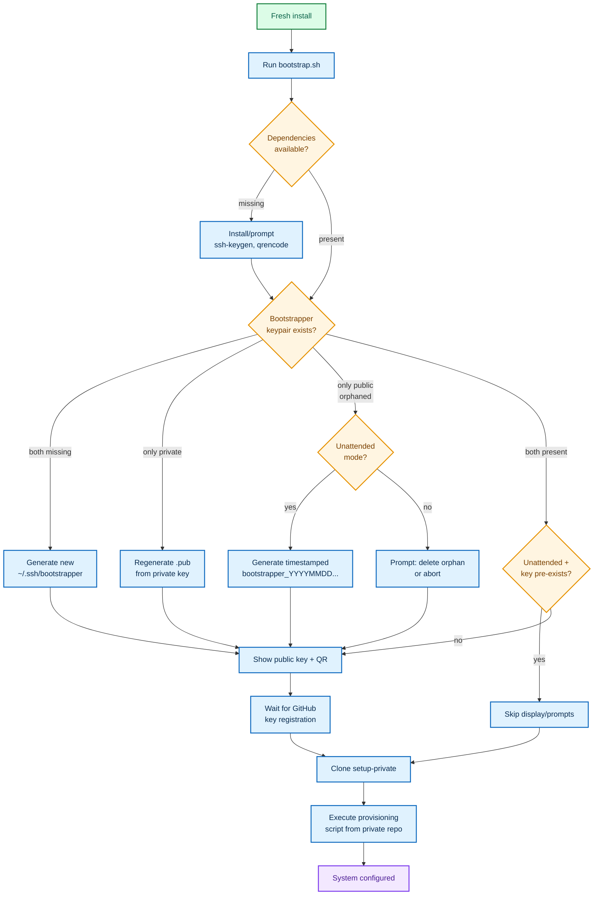

# machine-boostrapper

[](https://github.com/Ryther/machine-bootstrapper/actions/workflows/shellcheck.yml?branch=main)

Public bootstrap for a fresh machine — prepares base environment, SSH key, clones a private repo, and runs its provisioning script.

> **Contributing?** See [CONTRIBUTING.md](CONTRIBUTING.md) for development workflow, commit conventions, and tooling setup.

## 🚀 What is this

`machine-boostrapper` is a minimal, public bootstrap repository intended to:

- generate a dedicated SSH key (defaults to `~/.ssh/bootstrapper(.pub)`, configurable)
- display the public key + QR code for easy copy to GitHub
- clone a private `setup-private` repository
- execute a provisioning script from that private repo (defaults to `bootstrap.sh`, overridable per run)

This allows any fresh Linux/macOS install to become a workstation quickly while keeping sensitive configuration inside the private repo.

## 📦 Contents

- `bootstrap.sh` — the bootstrap script
- `.github/copilot-instructions.md` — instructions for AI assistance / future maintenance

## 🔧 Requirements

- `git` must already exist on the system (project policy).
- `ssh-keygen` is required; the bootstrapper can install it for you.
- `qrencode` is optional; when present it prints a QR code of the generated key.

When dependencies are missing the script asks whether it may install them. Answer “no” (or launch with `--no-install`) to see the list of commands and exit, or use `--auto-install` to approve installs up front. Pair any mode with `--unattended` when you need zero prompts, and `--dry-run` to preview the flow without making changes. Verbose mode (`--verbose`) timestamps each log line and enables POSIX tracing.

### Common install commands

| Platform | Command |
| --- | --- |
| Debian/Ubuntu | `sudo apt-get update && sudo apt-get install -y openssh-client qrencode` |
| Fedora/RHEL/CentOS | `sudo dnf install -y openssh-clients qrencode` (use `yum` on older releases) |
| Arch Linux | `sudo pacman -Sy --noconfirm openssh qrencode` |
| openSUSE | `sudo zypper install -y openssh qrencode` |
| macOS (Homebrew) | `brew install openssh qrencode` |

## 🎯 Usage

```bash
sh -c "$(curl -fsSL https://raw.githubusercontent.com/Ryther/machine-boostrapper/main/bootstrap.sh)" \
  -- [--auto-install] <git@github.com:<your-user>/setup-private.git> [branch] [script-path] [-- script-args...]
```

### Arguments & flags

- `--auto-install` / `--no-install` — allow or refuse automatic dependency installation (the prompt uses the same policy unless overridden per run).
- `--dry-run` — simulate every step (including dependency prompts) without modifying the machine.
- `-v, --verbose` — add timestamps to every log line and enable `set -x` tracing for deeper diagnostics.
- `--unattended` — suppress every interactive confirmation (e.g., orphaned key handling) and skip public-key display / prompts when the bootstrapper key already exists; combine with `--auto-install` for a fully non-interactive run.
- `--ssh-pub-key PATH` — override the SSH public key location (defaults to `~/.ssh/bootstrapper.pub`). The private key lives next to it (same filename without `.pub`).
- `<git repo>` — SSH URL to your private provisioning repository.
- `[branch]` — defaults to `main`.
- `[script-path]` — relative or absolute path to the provisioning script. Defaults to `bootstrap.sh` inside `~/setup-private`.
- `[-- script-args...]` — optional arguments forwarded verbatim to the provisioning script. Use `--` to skip overriding the script path while still passing arguments.

Our **baseline standard** assumes every `setup-private` repo exposes a root-level `bootstrap.sh`. Teams with different entry points can override `script-path` per invocation without forking this public bootstrapper.

### Examples

Use project defaults:

```bash
sh -c "$(curl -fsSL https://raw.githubusercontent.com/acme/machine-boostrapper/main/bootstrap.sh)" \
  -- git@github.com:acme/setup-private.git
```

Custom script and arguments:

```bash
sh -c "$(curl -fsSL https://raw.githubusercontent.com/acme/machine-boostrapper/main/bootstrap.sh)" \
  -- --auto-install git@github.com:acme/setup-private.git develop scripts/workstation.sh -- --with-gpu --timezone UTC
```

### SSH key naming

By default the script maintains `~/.ssh/bootstrapper` + `~/.ssh/bootstrapper.pub`. If both halves already exist they are reused as-is. When neither file exists, a new pair is generated in-place.

If the private key exists but the `.pub` is missing, the bootstrapper automatically recreates the public key (or describes it under `--dry-run`).

If an orphaned public key remains without its private counterpart, the bootstrapper stops with an error unless you opt into unattended mode (which then writes a fresh pair named `bootstrapper_<timestamp>`). This prevents accidental deletion yet still allows CI/automated runs to recover cleanly when requested.

## Flow

